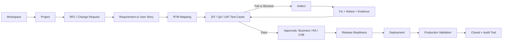
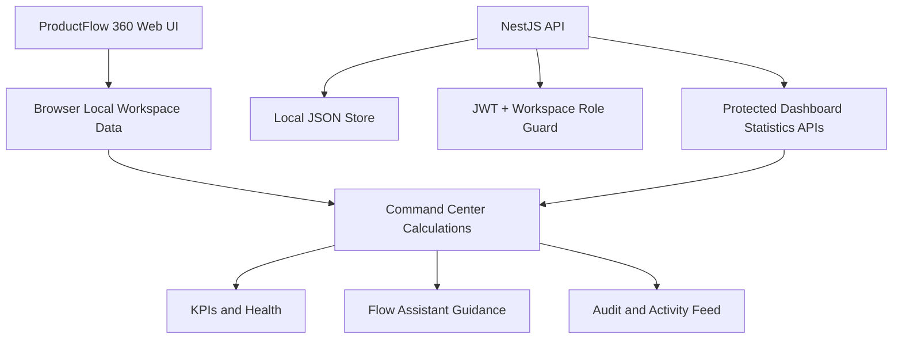
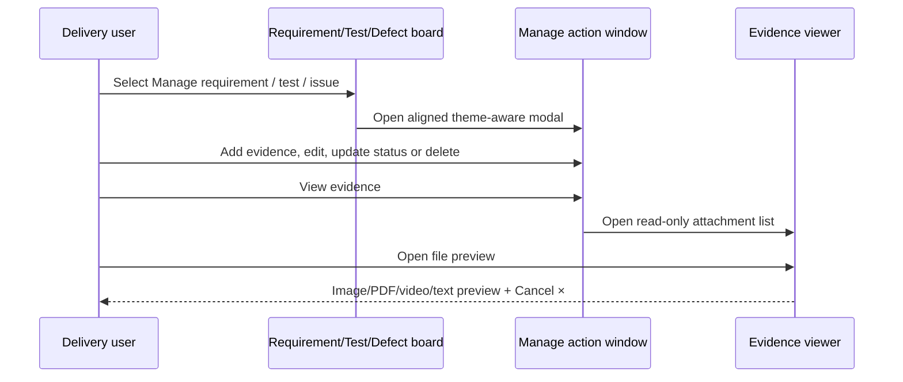

# ProductFlow 360

ProductFlow 360 (PF360) is a PTCL product-delivery command workspace. It brings the complete delivery journey—workspace setup, RFCs, requirements, RTM, testing, evidence, defects, approvals and release readiness—into one connected operational flow.

It is designed for Product, Business, QA, Development, Revenue Assurance and delivery leadership teams that need a clear, traceable view from idea to production validation.

## What it delivers

- Multi-workspace delivery management with a persistent workspace switcher.
- Change-request and RFC management with ownership, due dates, status, priority, editing and document evidence.
- Requirements Traceability Matrix (RTM): manual creation, Excel/CSV extraction, custom fields, unlimited test cases, edit/delete, evidence and export.
- SIT, QA and UAT execution with linked test cases, retest history, failures, blockers and evidence.
- Lifecycle boards for requirements, defects, approvals, configuration, billing validation, revenue assurance and releases.
- A consolidated Command Center with delivery KPIs, health, RFC pipeline, UAT, bugs, releases, approvals, My Work, audit activity, insights and quick actions.
- Employee sign-up/login, profile pictures, department-based registration, approval-gated accounts and Admin Board controls.
- Extracted report editing and per-record evidence preview.

## Delivery design



### Command Center data flow



## Product modules

| Module | Operational purpose |
| --- | --- |
| Command Center | Portfolio-level delivery controls, calculated metrics, health, alerts, activity and guided next actions. |
| Workspaces and projects | Create workspaces with accountable owner, start date, description and image; link delivery work to the active workspace. |
| Change requests | Create, update, review, export and attach documents/evidence to RFCs. |
| RTM | Import or create traceability matrices, define custom fields, map requirements to tests and export the result. |
| Test management | Build and execute SIT/QA/UAT cases, retest failures, retain history and link defects. |
| Lifecycle boards | Manage requirements, defects, UAT approvals, configuration, billing, revenue assurance and releases. |
| Reports | Extract XLSX/CSV data, filter/search/sort, edit rows, add/delete rows, attach per-row evidence and export filtered results. |
| Evidence | Attach and preview images, videos, PDF, Office files, JSON, text and log files against delivery records. |
| Administration | Approve accounts, manage departments, user roles and access status through the Admin Board. |

## Latest delivery-control experience

The current UI focuses on a consistent, operationally safe board experience across requirements, test cases and defects.

| Area | Current behaviour |
| --- | --- |
| Requirements board | A requirement record is opened from **Manage requirement**, rather than from an accidental row click. The action window provides view, add evidence, view evidence, edit and delete controls. |
| Test Management board | Standard test-case fields include ID, title, objective, module, linked RFC, preconditions, steps, test data, expected result, actual result, status, remarks, owner and priority. Cases can be created manually or imported/exported as CSV. |
| Defect board | Jira-style independent or RFC-linked issues support description, actual result, owner, priority, linked test case, multiple attachments and an action-led issue workflow. |
| Evidence controls | **Add evidence** opens the upload flow. **View evidence** is read-only and shows only attached files. A file name or **View file** opens image, PDF, video or text preview; Office files provide an in-window download handoff. |
| Evidence preview | Image/PDF content fills an aligned, theme-aware modal. It has a persistent header, `Cancel ×`, zoom for images, and expand/restore controls. |
| Theming and accessibility | Management modals use shared theme variables for readable light/dark/contrast surfaces, visible focus states, responsive modal dimensions and non-overlapping action bars. |

### Board action flow



## Command Center

The Command Center is the delivery-control layer. It reads the currently available workspace data and calculates rather than hardcodes its information.

- Executive metrics: active projects, open RFCs, UAT work, critical bugs, pending approvals, releases and blocked items.
- Project health: Green/Amber/Red indicator based on completion, overdue work, risk and blockers.
- RFC pipeline: Draft → Review → FS → Development → UAT → RA Validation → CAB → Deployment → Closed.
- UAT control: passed, failed, blocked, not-executed and sign-off indicators.
- Bug and release center: linked work, owners, status and release gate reminders.
- Approval inbox, My Work and lifecycle audit activity.
- Command palette with `Ctrl + K` on Windows/Linux or `⌘ + K` on macOS.
- Flow Assistant: stable, deterministic operational guidance based on saved RFC, test, defect, approval and release data. It never makes automatic changes.

## Flow Assistant modes

The default **Local Workspace Assistant** is intentionally deterministic. It gives clear delivery recommendations from browser-saved records and does not send content to any external provider.

The **API-ready** selection is a protected integration placeholder. It remains in safe local fallback mode until a server-side provider integration, authentication, rate limits and protected environment secret have been configured. Never put an AI provider key in the browser.

## User roles and access

| Role | Primary access |
| --- | --- |
| Admin | Account approvals, roles, departments, full workspace administration and Admin Board. |
| Department Manager | Department delivery visibility and managed work. |
| Employee | Assigned delivery work, workspace records, profile settings and evidence. |

All employee accounts start as **Pending**. An administrator must approve them before sign-in. The local demo administrator is:

```text
Email: admin@ptcl.com
Password: PTCLAdmin!2026
```

## Evidence and storage behavior

Evidence belongs to each individual RFC, lifecycle record, requirement, test case, test execution, RTM row or report row. Supported file types include images, video, PDF, DOC/DOCX, XLS/XLSX, CSV, JSON, TXT and LOG, up to 50 MiB per file. Multiple files can be attached to the same record.

Evidence is deliberately split into two modes:

- **Add evidence**: accepts multiple attachments and supports removing an attachment while editing.
- **View evidence**: a read-only attachment list without upload controls. Every attachment is explicitly clickable through its name and a **View file** button.

The web prototype stores operational data in the browser using localStorage and IndexedDB. Clearing browser site data removes this local prototype data. The API uses a local JSON file for development. These choices make the project simple to run without Docker, but production requires managed database and object storage.

## Architecture

```text
apps/
  web/                  Next.js 16 application
    app/                Shell, layout, styling and routes
    components/         Reusable delivery, RTM, auth and Command Center UI
    lib/                Browser-local domain models and persistence helpers
  api/                  NestJS API
    src/main.ts         JWT authentication, workspace guard and entity/dashboard APIs
    src/local-store.ts  Development JSON persistence
    migrations/         Initial local data migration
tests/                  Playwright browser coverage
docs/                   Delivery and enhancement documentation
```

## API foundation

The NestJS API is secured with JWT bearer authentication and workspace-scoped entity access. A Viewer is read-only. Each create/update writes an audit entry.

### Core endpoints

| Endpoint | Purpose |
| --- | --- |
| `GET /health` | API and local store health check. |
| `POST /auth/login` | Returns a short-lived bearer token. |
| `GET /api/:type` | Lists workspace-scoped entities. |
| `POST /api/:type` | Creates a workspace-scoped entity. |
| `POST /api/:type/:id` | Updates a workspace-scoped entity and writes an audit record. |

Supported entity types include `project`, `rfc`, `user-story`, `requirement`, `test-case`, `test-run`, `bug`, `document`, `comment`, `link`, `release`, `approval` and `risk`.

### Command Center endpoints

All require `Authorization: Bearer <token>`:

```text
GET /dashboard/summary
GET /dashboard/project-health
GET /dashboard/rfc-statistics
GET /dashboard/uat-statistics
GET /dashboard/bug-statistics
GET /dashboard/release-statistics
GET /dashboard/approval-statistics
GET /dashboard/workload
GET /dashboard/risks
GET /dashboard/activity-feed
GET /dashboard/notifications
```

## Run locally

Requirements: Node.js 24 LTS and npm.

```sh
npm install
npm run dev
```

Open [http://localhost:3000](http://localhost:3000).

### Verification

```sh
npm run typecheck
npm run build
npm run api:build
npm test
git diff --check
```

### Run API without Docker

```sh
cp .env.example .env
npm run migrate --workspace apps/api
npm run provision:user --workspace apps/api -- admin@example.com "PF360 Admin" "use-a-strong-password" "PTCL QA Workspace" "Super Admin"
npm run api:dev
```

The API uses `apps/api/.data/pf360.json` in local development, so no Docker or PostgreSQL service is required to evaluate the project.

## Quality and production roadmap

Playwright remains included because it protects core browser behavior such as login/password visibility, attachments, evidence preview, RFC-linked test/retest history, workspace changes, theme persistence and responsive UI.

Before production use, migrate browser/file persistence to managed PostgreSQL plus object storage; add PTCL SSO, server-side sessions, password reset/MFA, HTTPS, secret management, backups, observability, organization-specific RBAC and API rate limiting.

## References

- [Implementation plan](docs/IMPLEMENTATION-PLAN.md)
- [Enhancement prompt](docs/ENHANCEMENT-PROMPT.md)
- [Product description](docs/PRODUCT-DESCRIPTION.md)
