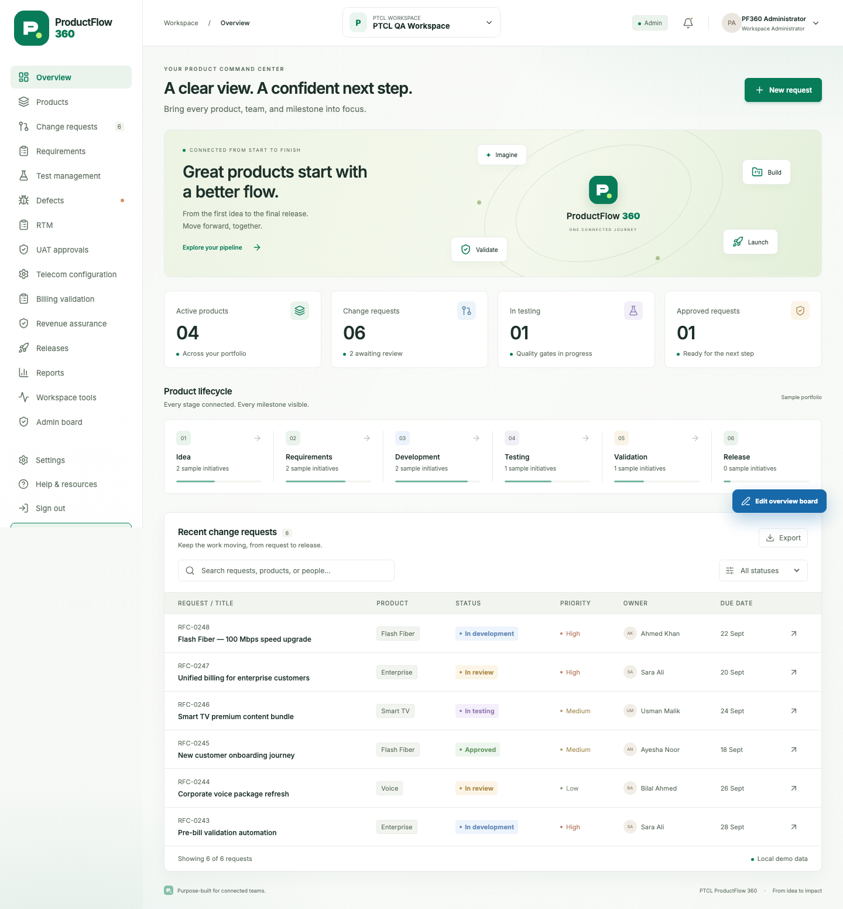
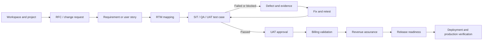
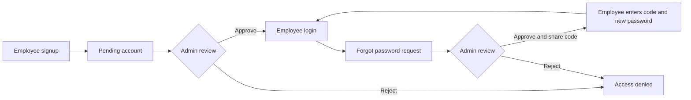
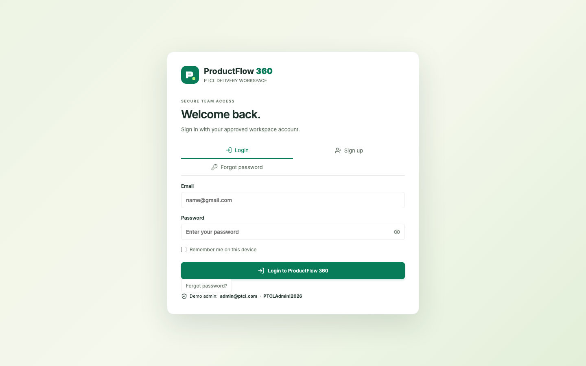
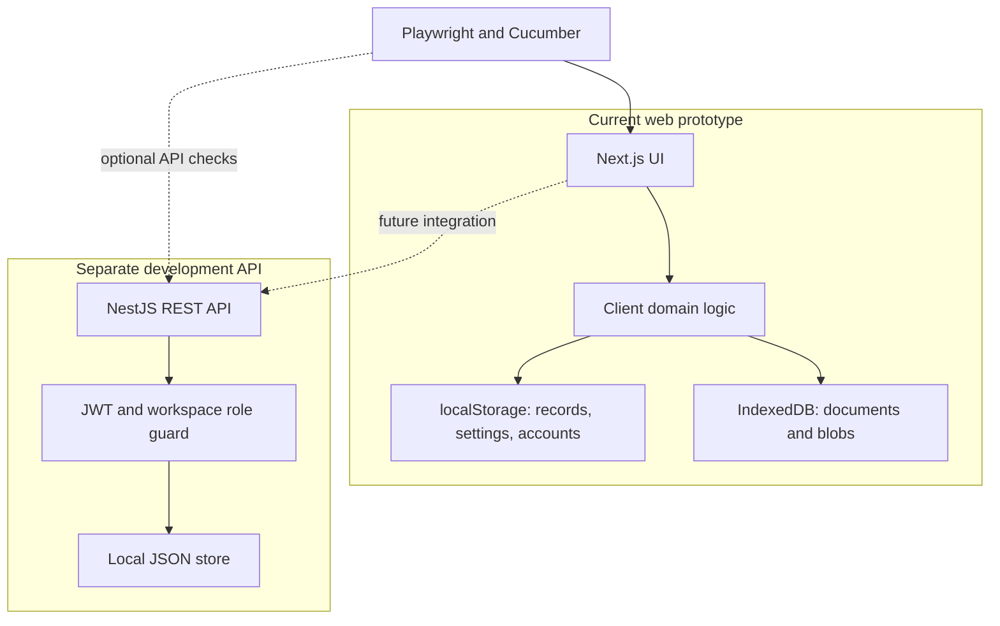
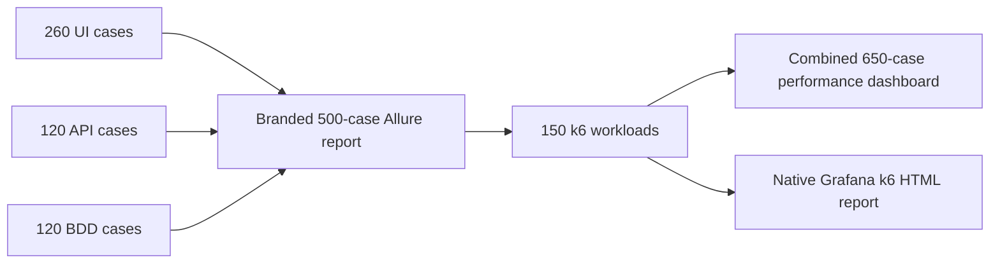
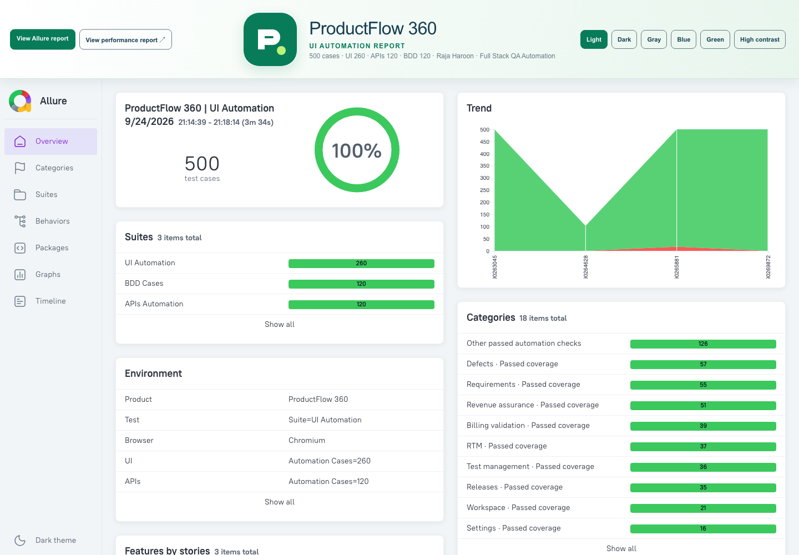
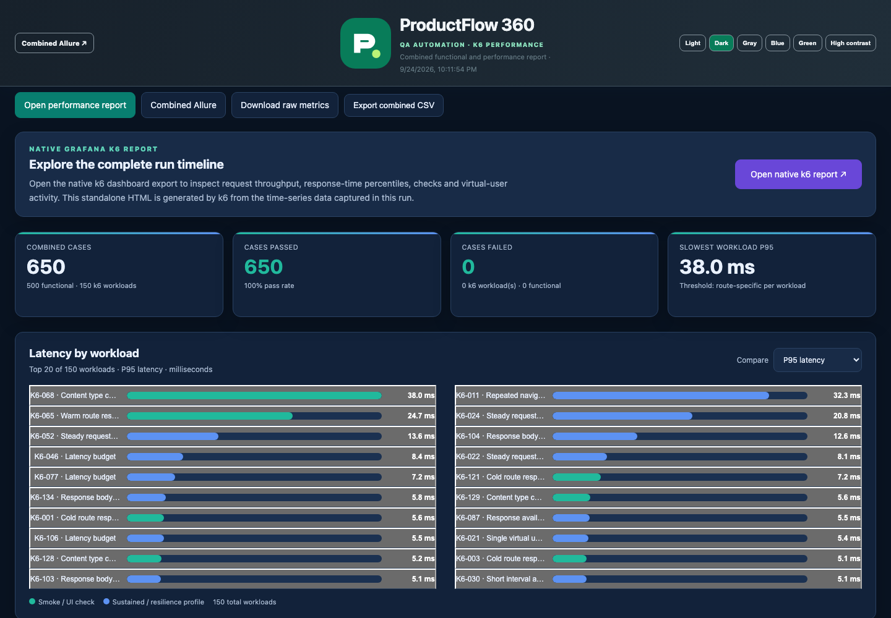
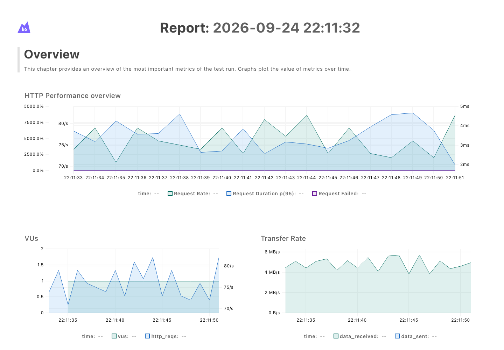

# ProductFlow 360

<p align="center"></p>

<p align="center"><strong>One workspace for product delivery, quality, evidence, and release decisions.</strong></p>

ProductFlow 360 is a PTCL delivery workspace for connecting projects, change requests, requirements, RTMs, test cases, defects, billing validation, revenue assurance, and releases. The current web experience is a **browser-local prototype**. A separate NestJS API exists for development and is **not yet the web application's shared data store**.



## At a glance

| Area | What is available now |
| --- | --- |
| Delivery | Workspaces, products, projects, RFCs, requirements, RTM, test management, defects, approvals, billing, revenue assurance, releases, reports, and evidence. |
| Access | Employee signup, administrator approval, login, profile, and administrator-reviewed employee password recovery in the browser prototype. |
| Automation | **500 functional cases** in the branded Allure report: 260 UI, 120 API, and 120 BDD. |
| Performance | **150 k6 workloads**, with a combined ProductFlow dashboard and native Grafana k6 HTML report. Latest saved run: 150/150 workloads passed and 1,500 requests recorded. |
| Stack | Next.js 16 and React 19 web app; NestJS 12 API with a local JSON development store; TypeScript automation. |

## Product journey



The links between records let a delivery team follow a request from its owner and requirements through testing, financial checks, and release. The UI also provides search, filtering, import or export where supported, attachments, and an audit-oriented activity view.

## Key screens

| Screen | Main work |
| --- | --- |
| Command Center | Portfolio overview, request pipeline, metrics, alerts, and next actions. |
| Workspaces and products | Select a workspace, register projects, and browse the product portfolio. |
| Change requests | Create and manage RFCs with status, owner, priority, documents, and linked delivery work. |
| Requirements and RTM | Capture requirements, create or import matrices, and connect requirements to test coverage. |
| Test Management and Defects | Define cases, execute or retest, record outcomes, attach evidence, and triage issues. |
| UAT, billing, revenue, and releases | Review approval and validation records, then check release readiness. |
| Admin Board | Review employee signups, roles, departments, and employee password reset requests. |

### Employee access flow





The browser prototype stores account records and recovery state locally. The administrator must share an approved recovery code with a verified employee through an appropriate channel. This workflow is suitable for demonstration and test automation, not production identity assurance.

## Architecture and data boundaries



The API provides JWT login, workspace-scoped entities, dashboard endpoints, and audit writes. The web UI currently uses browser persistence; starting the API does not make web data shared across browsers. The API's active store is `apps/api/.data/pf360.json`. Prisma and PostgreSQL packages are present for future work, but the current API reads and writes the local JSON store.

### Repository map

| Path | Purpose |
| --- | --- |
| `apps/web/app`, `apps/web/components`, `apps/web/lib` | Next.js shell, product UI, browser-local workflows and persistence. |
| `apps/web/public/logo.svg` | ProductFlow 360 brand mark. |
| `apps/api/src` | NestJS endpoints, JWT authorization, dashboard aggregation, local store. |
| `playwright/tests/ui` | Playwright browser tests. |
| `playwright/features`, `playwright/step-definitions` | Executable Cucumber BDD scenarios and steps. |
| `playwright/src/ui/locators`, `playwright/src/ui/pages` | Screen selectors and page objects. |
| `playwright/performance` | 150 workload definitions, k6 runner script, and combined report dashboard template. |
| `playwright/scripts` | Allure, API, BDD, and k6 runners/report generation. |
| `docs/images/automation-report-snapshots` | Latest captured Allure, combined k6, and native k6 report screenshots. |
| `docs` | Product notes, implementation status, and documentation images. |

## Run locally

Requirements: Node.js 24 and npm. From the repository root:

```bash
npm install
npm run dev
```

Open [http://localhost:3000](http://localhost:3000). The local demo administrator is `admin@ptcl.com` with password `PTCLAdmin!2026` (also shown on the prototype login screen). Change or remove this bootstrap account before any shared deployment.

To run the separate development API, copy `.env.example` to `.env`, then provision a user and start the service:

```bash
cp .env.example .env
npm run migrate --workspace apps/api
npm run provision:user --workspace apps/api -- admin@example.com "PF360 Admin" "use-a-strong-password" "PTCL QA Workspace" "Super Admin"
npm run api:dev
```

`GET /health` reports API and local-store health. Authenticated endpoints include `POST /auth/login`, workspace-scoped `/api/:type` records, and `/dashboard/*` statistics. API data is separate from browser-local UI data.

## Quality and reports



### Latest report screenshots

The screenshots below were captured from the latest generated reports. The functional Allure run has three top-level sections. The k6 dashboard joins those 500 functional results with 150 performance workloads; the native k6 export shows the time-series view from the same run.

#### Allure: 500 functional cases



#### Combined performance: 650 functional and k6 cases



#### Native Grafana k6 report



### What the 500 functional cases cover

| Allure section | Count | Coverage |
| --- | ---: | --- |
| **UI Automation** | **260** | Chromium UI navigation, module availability, record forms, field and selector contracts, cancel/draft recovery, search and empty states, and workflow interactions. Includes smoke, regression, and negative search coverage across the workspace, RTM, test management, defects, requirements, billing validation, revenue assurance, releases, settings, and related screens. |
| **APIs Automation** | **120** | API health/readiness; login input validation and credential cases; success/token contracts; missing, malformed, or invalid authorization; protected resource checks; entity create/read workflows; and dashboard endpoint access. The runner creates an isolated temporary API store and test account for the API suite. |
| **BDD Cases** | **120** | Gherkin-driven delivery board visibility, creation form fields, draft cancellation, unmatched searches, and supported workflow options across Defects, Requirements, Revenue Assurance, Test Management, and RTM. This includes the original component feature scenarios and the expanded BDD case catalogue. |
| **Total** | **500** | One branded Allure report with UI Automation, APIs Automation, and BDD Cases suites. |

The 260 UI cases include the original UI coverage plus 45 navigation smoke checks, 62 regression checks for forms and board controls, and 70 negative unmatched-search checks. Allure groups tests by suite/component and includes the evidence produced by each layer: browser screenshots/videos for UI and BDD flows, and request/response evidence for API checks.

### What the 150 k6 workloads cover

The k6 suite targets the local ProductFlow 360 workspace page, the JavaScript bundle discovered from that page, and the ProductFlow logo asset. Its 150 uniquely named cases cross three target resources with 10 workload focuses and five request profiles:

| Dimension | Breakdown |
| --- | --- |
| Workload focuses | Smoke: cold and warm response, content type; Regression: repeated navigation, body integrity, latency budget; Capacity baseline: one-VU baseline, steady request handling, availability; Resilience: short-interval availability. |
| Request profiles | Standard request, browser Accept headers, no-cache headers, English locale header, and cache-bypass query. |
| Targets | Workspace HTML (`/`), its discovered JavaScript bundle, and `/logo.svg`. |
| Default execution | 10 requests per case, one virtual user: 1,500 total HTTP requests in the latest saved run. |
| Checks | HTTP 200, expected response content type, non-empty response body, and per-route latency budget. k6 thresholds also check failed-request rate, overall p95 latency, and check pass rate. |

The default profile is a low-load local baseline, not a production capacity claim. Configure it with `PF360_K6_REPEATS`, `PF360_K6_VUS`, `PF360_K6_MAX_DURATION`, `PF360_PERF_BASE_URL`, and `K6_BIN` as needed. The combined dashboard provides latency comparisons, workload search and details, six visual modes, and CSV/JSON/raw-metric downloads. The native export is generated by k6's [web dashboard output](https://grafana.com/docs/k6/latest/results-output/web-dashboard/).

Latest saved run (24 September 2026): Allure **500/500 passed**; k6 **150/150 passed**, **1,500 requests**, overall request p95 **3.74 ms**. These timing values describe that local run and depend on the host and app build.

### Generate the reports

Install the browser and Grafana k6 (for example `brew install k6` on macOS). Start the web app on port 3100 in one terminal:

```bash
npx playwright install chromium
npm run dev --workspace apps/web -- --hostname 127.0.0.1 --port 3100
```

Then generate both report sets from the repository root, in order:

```bash
npm run test:allure
npm run test:k6
```

The Allure runner generates the 500 functional results. The k6 runner consumes that Allure data and creates its 150 workload results and native HTML export. **Run k6 after Allure:** Allure report generation cleans the output folder and can remove existing performance files. To refresh only the report from current Allure results, use `npm run report:allure`, then run `npm run test:k6` again to restore the combined performance files.

Open the reports in Chrome:

| Report | URL |
| --- | --- |
| Branded Allure report | <http://127.0.0.1:3100/reports/allure/index.html> |
| Combined performance dashboard | <http://127.0.0.1:3100/reports/allure/performance/index.html> |
| Native k6 HTML report | <http://127.0.0.1:3100/reports/allure/performance/native-k6-report.html> |

Generated reports live under `playwright/reports/allure` and are ignored by Git; the committed README screenshots above are static snapshots of the latest saved run. See the [detailed automation guide](playwright/README.md) and [automation architecture](playwright/docs/AUTOMATION_ARCHITECTURE.md) for suite structure and configuration.

## Current limits and next steps

Browser storage is device-local and clearing site data removes local records. Authentication and password recovery in the web prototype are not server-backed. Production work includes connecting the UI to the API, managed database and file storage, organization identity, server-side access enforcement, backups, monitoring, and real billing integrations. The [implementation plan](docs/IMPLEMENTATION-PLAN.md) distinguishes current behavior from the target architecture.

## Further reading

- [Product description](docs/PRODUCT-DESCRIPTION.md)
- [Implementation plan](docs/IMPLEMENTATION-PLAN.md)
- [Automation architecture](playwright/docs/AUTOMATION_ARCHITECTURE.md)
