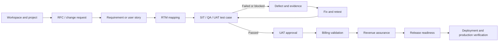
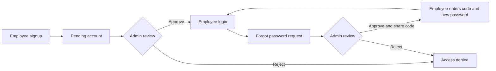
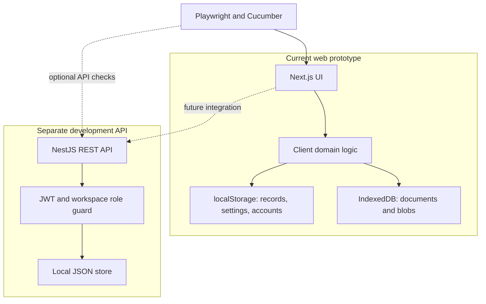
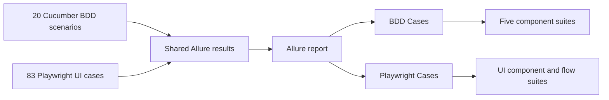

# ProductFlow 360

<p align="center"></p>

<p align="center"><strong>One workspace for product delivery, quality, evidence, and release decisions.</strong></p>

ProductFlow 360 is a PTCL delivery workspace for connecting projects, change requests, requirements, RTMs, test cases, defects, billing validation, revenue assurance, and releases. The current web experience is a **browser-local prototype**. A separate NestJS API exists for development and is **not yet the web application's shared data store**.


## At a glance

| Area | What is available now |
| --- | --- |
| Delivery | Workspaces, products, projects, RFCs, requirements, RTM, test management, defects, approvals, billing, revenue assurance, releases, reports, and evidence. |
| Access | Employee signup, administrator approval, login, profile, and administrator-reviewed employee password recovery in the browser prototype. |
| Automation | **83 Playwright UI cases + 20 Cucumber BDD scenarios** in one Allure report; Chromium run verified at **103/103 passed**. |
| Stack | Next.js 16 and React 19 web app; NestJS 12 API with a local JSON development store; TypeScript automation. |

## Product journey



The links between records let a delivery team follow a request from its owner and requirements through testing, financial checks, and release. The UI also provides search, filtering, import or export where supported, attachments, and an audit-oriented activity view.

## Key screens

| Screen | Main work |
| --- | --- |
| Command Center | Portfolio overview, request pipeline, metrics, alerts, and next actions. |
| Workspaces and products | Select a workspace, register projects, and browse the product portfolio. |
| Change requests | Create and manage RFCs with status, owner, priority, documents, and linked delivery work. |
| Requirements and RTM | Capture requirements, create or import matrices, and connect requirements to test coverage. |
| Test Management and Defects | Define cases, execute or retest, record outcomes, attach evidence, and triage issues. |
| UAT, billing, revenue, and releases | Review approval and validation records, then check release readiness. |
| Admin Board | Review employee signups, roles, departments, and employee password reset requests. |

### Employee access flow




The browser prototype stores account records and recovery state locally. The administrator must share an approved recovery code with a verified employee through an appropriate channel. This workflow is suitable for demonstration and test automation, not production identity assurance.

## Architecture and data boundaries



The API provides JWT login, workspace-scoped entities, dashboard endpoints, and audit writes. The web UI currently uses browser persistence; starting the API does not make web data shared across browsers. The API's active store is `apps/api/.data/pf360.json`. Prisma and PostgreSQL packages are present for future work, but the current API reads and writes the local JSON store.

### Repository map

| Path | Purpose |
| --- | --- |
| `apps/web/app`, `apps/web/components`, `apps/web/lib` | Next.js shell, product UI, browser-local workflows and persistence. |
| `apps/web/public/logo.svg` | ProductFlow 360 brand mark. |
| `apps/api/src` | NestJS endpoints, JWT authorization, dashboard aggregation, local store. |
| `playwright/tests/ui` | Playwright browser tests. |
| `playwright/features`, `playwright/step-definitions` | Executable Cucumber BDD scenarios and steps. |
| `playwright/src/ui/locators`, `playwright/src/ui/pages` | Screen selectors and page objects. |
| `docs` | Product notes, implementation status, and documentation images. |

## Run locally

Requirements: Node.js 24 and npm. From the repository root:

```bash
npm install
npm run dev
```

Open [http://localhost:3000](http://localhost:3000). The local demo administrator is `admin@ptcl.com` with password `PTCLAdmin!2026` (also shown on the prototype login screen). Change or remove this bootstrap account before any shared deployment.

To run the separate development API, copy `.env.example` to `.env`, then provision a user and start the service:

```bash
cp .env.example .env
npm run migrate --workspace apps/api
npm run provision:user --workspace apps/api -- admin@example.com "PF360 Admin" "use-a-strong-password" "PTCL QA Workspace" "Super Admin"
npm run api:dev
```

`GET /health` reports API and local-store health. Authenticated endpoints include `POST /auth/login`, workspace-scoped `/api/:type` records, and `/dashboard/*` statistics. API data is separate from browser-local UI data.

## Quality and reports



```bash
npx playwright install chromium
npm run typecheck
npm run api:build
npm run test:allure
env -u JAVA_HOME npx allure open playwright/reports/allure --port 5052
```

`npm run test:allure` starts the local web app and runs both suites. The generated report is local and ignored by Git. BDD scenarios have Gherkin steps, screenshots, and videos; Playwright cases also include screenshot and video evidence. The API health tests require a running NestJS API and `PF360_RUN_API_TESTS=1`; otherwise they are skipped. See the [automation guide](playwright/README.md) and [functional automation diagrams](playwright/docs/AUTOMATION_ARCHITECTURE.md).

## Current limits and next steps

Browser storage is device-local and clearing site data removes local records. Authentication and password recovery in the web prototype are not server-backed. Production work includes connecting the UI to the API, managed database and file storage, organization identity, server-side access enforcement, backups, monitoring, and real billing integrations. The [implementation plan](docs/IMPLEMENTATION-PLAN.md) distinguishes current behavior from the target architecture.

## Further reading

- [Product description](docs/PRODUCT-DESCRIPTION.md)
- [Implementation plan](docs/IMPLEMENTATION-PLAN.md)
- [Automation architecture](playwright/docs/AUTOMATION_ARCHITECTURE.md)
