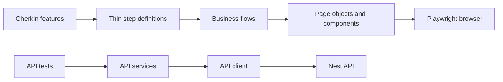
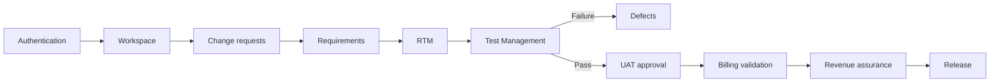

# ProductFlow 360 Automation

This folder contains the scalable QA automation framework for ProductFlow 360. It preserves the application and separates UI browser automation from API automation.

## Architecture



`tests/ui` contains executable Playwright UI tests. `features` is the executable Cucumber BDD layer. Page objects own screen actions, components own reusable navigation, and tests retain assertions.

### Locator Selector Hub

All screen selectors belong in `src/ui/locators/`: Login, Navigation, Workspace, RFC, Requirement, RTM, Test Case, Defect and Evidence each have their own hub. Page Objects call these hubs rather than declaring selectors inline. `xpath-fallbacks.ts` is intentionally isolated for legacy cases only; new automation must prefer role, label, placeholder and `data-testid` locators.

## Layout

| Path | Responsibility |
| --- | --- |
| `config/` | Environment selection and browser configuration. |
| `src/ui/pages`, `src/ui/components` | POM and reusable UI controls. |
| `src/api/clients`, `src/api/services` | APIRequestContext client and service layer. |
| `tests/ui`, `tests/api` | Executable UI and API automation. |
| `features`, `step-definitions` | Gherkin scenarios and thin BDD mappings. |
| `test-data/` | Non-secret JSON data. |
| `reports/`, `artifacts/` | Generated reports and failure evidence; ignored by Git. |

Each UI module has its own spec page under `tests/ui`: `workspace.spec.ts`, `rtm.spec.ts`, `test-management.spec.ts`, `defects.spec.ts`, plus authentication and smoke coverage. Every module suite uses `beforeEach` for independent login/navigation setup and contains explicit positive and negative assertions.

`core-components.spec.ts` and `lifecycle-components.spec.ts` add five focused cases each for Settings, Workspace, Products, Change Requests, Test Management, RTM, Billing Validation, Revenue Assurance, Releases, Requirements and Defects. Their page objects use screen-specific files under `src/ui/locators/`; Allure groups each component under its own suite. The verified Chromium UI run contains 83 tests, including smoke, authentication, signup, recovery and end-to-end cases.

## Functional model



The automation follows this same traceability path. Full layer, lifecycle, BDD and report diagrams are documented in [Automation Architecture](docs/AUTOMATION_ARCHITECTURE.md).

## Install and configure

```bash
cd playwright
npm install
npx playwright install
cp .env.example .env
```

Set secrets with environment variables or CI secrets. Do not commit real passwords, tokens or storage state. `TEST_ENV=dev|qa|staging` selects the matching documented environment contract; CI should inject its own `BASE_URL`, `API_BASE_URL`, `TEST_USER_EMAIL` and `TEST_USER_PASSWORD`.

## Execute

From the repository root:

```bash
npm run test:ui
npm run test:smoke
npm run test:regression
npm run test:api
npm run test:bdd:allure
```

From this folder, use `npm run test:chromium`, `npm run test:firefox`, `npm run test:webkit`, `npm run test:headed` (add `--headed`), or `npm run report`. The default root run targets Chromium only; cross-browser execution is intentional rather than automatic for every local change.

Every test records a video and screenshot so passing flows are visible in Allure; failed tests also retain traces. Open a trace with `npx playwright show-trace <trace.zip>` and reports with `npx playwright show-report reports/playwright`.

### BDD Cases

`npm run test:bdd:allure` starts the local app, runs 20 Chromium Cucumber scenarios, and generates a BDD-only report at `playwright/reports/allure`. The five feature files under `features/rtm`, `features/defects`, `features/test-management`, `features/requirements`, and `features/revenue-assurance` contain four scenarios each. Their Given/When/Then steps have browser assertions in `step-definitions/component.steps.ts` and shared browser setup in `support/bdd-world.ts`.

Allure displays **BDD Cases** as the parent suite with a separate suite for each component. Each scenario includes its Gherkin steps, final screenshot, and execution video. To serve the report locally, run `env -u JAVA_HOME npx allure open playwright/reports/allure --port 5051` from the repository root.

### Allure report branding

`npm run test:allure` clears previous Allure results, runs the 20 BDD scenarios and all 83 existing Chromium Playwright UI cases, then produces one branded report at `playwright/reports/allure`. The report title is **ProductFlow 360 | BDD + Playwright Cases**. Its Suites view has two top-level groups: **BDD Cases** and **Playwright Cases**, each with component suites beneath it. Branded scenarios carry Owner **Raja Haroon** and Designation **Full Stack QA Automation** labels; the PF360 logo is copied from the application asset into the Allure result bundle. The report script ignores a stale `JAVA_HOME` when Java is available on `PATH`.

The report pipeline preserves history between clean runs so Overview trend charts remain populated. It adds ProductFlow 360 categories, local or CI executor details, environment metadata, module-based Packages, Behaviors and Suites, test descriptions, and a large branded report header. Every generated test entry includes its component, execution layer, owner, environment, screenshot and video evidence.

`signup-flow.spec.ts` and `forgot-password-flow.spec.ts` cover separate employee access flows: signup submission and admin approval, reset request and admin review, one-time recovery code validation, password replacement and login with the new credential. The administrator shares the recovery code with the verified employee through an approved channel; the code is shown in the Admin Board and invalidated after use. This browser-local prototype does not provide server-side identity verification or secure secret storage, so production recovery requires a backend and a trusted delivery channel.

## Extending the framework

1. Create a page object action in `src/ui/pages` using `getByRole`, `getByLabel`, then `getByPlaceholder` before CSS selectors.
2. Add a business flow only when it crosses pages.
3. Add a focused test under `tests/ui` or `tests/api`.
4. Add an optional business-readable feature and a thin step definition.
5. Keep data in JSON/factories and make generated records identifiable as automation data.

API tests must use a service built on `BaseApiClient`; endpoint paths must not be scattered through UI pages. The current browser-local prototype does not expose every requested CRUD API in a production shape, so API coverage begins with health and expands when server endpoints are enabled.

## CI

CI installs dependencies and browsers, runs typecheck/API tests/UI smoke, then uploads `playwright/reports` and `playwright/artifacts` on failure. Never upload secrets, local auth state or customer evidence.
