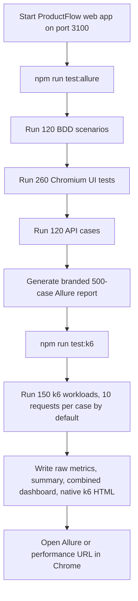

# ProductFlow 360 Automation and Reports

This guide covers the functional automation suite, the branded Allure report, and the k6 performance reports. The combined report set contains **500 functional cases** and **150 k6 workloads**. Run functional automation first and k6 second so both report sets are available together.

## Report overview

| Report section | Cases | What it covers |
| --- | ---: | --- |
| UI Automation | 260 | Chromium UI smoke, regression, and negative flows across ProductFlow modules. |
| APIs Automation | 120 | API checks grouped in Allure under the API automation section. |
| BDD Cases | 120 | Cucumber scenarios with readable Gherkin steps and component suites. |
| **Functional Allure total** | **500** | The three functional sections above. |
| k6 Performance | 150 | Local HTTP workloads with repeatable request profiles and per-workload latency details. |
| **Combined dashboard total** | **650** | The 500 Allure cases plus 150 k6 workloads. |

After both runs, open these pages from the ProductFlow web app:

| Page | Local URL |
| --- | --- |
| Branded Allure report | <http://127.0.0.1:3100/reports/allure/index.html> |
| Combined performance dashboard | <http://127.0.0.1:3100/reports/allure/performance/index.html> |
| Native Grafana k6 web dashboard export | <http://127.0.0.1:3100/reports/allure/performance/native-k6-report.html> |

The Allure header links to the performance dashboard. The performance dashboard links back to Allure and the native k6 export. The dashboard includes combined totals, latency charts, workload search and details, theme choices, and CSV/JSON downloads.

## Full report flow



**Order matters:** `test:allure` and `report:allure` clean and regenerate the Allure output directory. Run k6 after Allure; otherwise a later Allure generation can remove the performance files. `test:k6` reads the generated Allure case data to produce the combined 650-case view.

## Setup

From the repository root:

```bash
npm install
npx playwright install chromium
```

The k6 runner requires Grafana k6 on `PATH` (or the executable path in `K6_BIN`). On macOS, install it with `brew install k6`; see the [Grafana k6 installation guide](https://grafana.com/docs/k6/latest/set-up/install-k6/). If the app is already built, start it on the report-serving port:

```bash
npm run build
npm run dev --workspace apps/web -- --hostname 127.0.0.1 --port 3100
```

Keep that terminal running. The combined Allure runner also checks port 3100 and can start the built web app itself when it is not already available. If you want to run k6 by itself, start the app first. The default target is `http://127.0.0.1:3100`; override it with `PF360_PERF_BASE_URL` when needed.

For environments and credentials, copy `playwright/.env.example` to `playwright/.env` when present and set the documented variables. Use CI secrets for real credentials; do not commit passwords, tokens, or browser storage state.

## Generate the combined reports

Run these commands from the repository root, in this order:

```bash
npm run test:allure
npm run test:k6
```

`npm run test:allure` resets the previous Allure run, executes the Cucumber BDD suite, the Chromium UI suite, and the API suite, then creates the branded combined report. `npm run test:k6` requires that Allure data, executes the 150-workload performance suite, and writes the combined performance dashboard plus the native k6 HTML export.

Open the reports in Chrome by navigating to the URLs in [Report overview](#report-overview). The web app's report route serves generated files from `playwright/reports/allure`; the reports are local artifacts and are not published automatically.

### Generate or view only Allure

```bash
npm run test:allure
```

Open `http://127.0.0.1:3100/reports/allure/index.html`. To regenerate a report from the current Allure results without rerunning cases:

```bash
npm run report:allure
```

Report-only generation cleans the output directory. If you need the performance dashboard afterward, rerun `npm run test:k6` after the Allure report is regenerated.

### Generate only the k6 reports

With a current Allure report already generated and the app responding on the target URL:

```bash
npm run test:k6
```

The runner creates 150 named workloads from the local workspace route, the JavaScript bundle discovered from the workspace response, and `/logo.svg`. The workload catalogue combines Smoke, Regression, Capacity baseline, and Resilience focuses with standard, browser Accept header, no-cache, English locale, and cache-bypass request profiles. Each workload defaults to 10 requests and one virtual user. Checks cover HTTP 200, content type, a non-empty response body, and route-specific latency budgets.

The script uses k6's web dashboard export to create `native-k6-report.html`. That is k6's native timeline and metrics view; the ProductFlow dashboard presents the same run with the Allure functional cases, workload search, charts, and exports. For details on k6's built-in export and thresholds, see the [Grafana k6 web dashboard documentation](https://grafana.com/docs/k6/latest/results-output/web-dashboard/) and [thresholds documentation](https://grafana.com/docs/k6/latest/using-k6/thresholds/).

### k6 settings

| Variable | Default | Purpose |
| --- | ---: | --- |
| `K6_BIN` | `k6` | k6 executable name or full path. |
| `PF360_PERF_BASE_URL` | `http://127.0.0.1:3100` | ProductFlow instance to exercise. |
| `PF360_K6_REPEATS` | `10` | Requests per workload. |
| `PF360_K6_VUS` | `1` | Virtual users. This is a low-load local baseline by default. |
| `PF360_K6_MAX_DURATION` | `3m` | Maximum k6 run duration. |

Example with five virtual users and five repetitions per workload:

```bash
PF360_K6_VUS=5 PF360_K6_REPEATS=5 npm run test:k6
```

Changing these settings changes the run intensity and the number of recorded request samples. The default is intended for a quick local baseline, not a production capacity claim.

## Generated files

| File or directory | Contents |
| --- | --- |
| `playwright/reports/allure/index.html` | Branded Allure report entry point. |
| `playwright/reports/allure/data/` | Allure report data, including the functional case details consumed by the combined dashboard. |
| `playwright/reports/allure/performance/index.html` | ProductFlow combined performance dashboard. |
| `playwright/reports/allure/performance/native-k6-report.html` | Native k6 web dashboard export. |
| `playwright/reports/allure/performance/summary.json` | Summary, thresholds, functional totals, and detailed workload rows. |
| `playwright/reports/allure/performance/k6-metrics.jsonl` | Raw k6 time-series metrics. |
| `playwright/performance/cases.json` | Workload catalogue generated for the latest k6 run. |

Reports and execution artifacts are generated locally and are ignored by Git. Preserve or archive the report directory separately if a run needs to be shared.

## Framework structure

| Path | Responsibility |
| --- | --- |
| `config/` | Environment selection and browser configuration. |
| `src/ui/pages`, `src/ui/components` | Page objects and reusable UI controls. |
| `src/ui/locators/` | Screen-specific locator hubs. |
| `src/api/clients`, `src/api/services` | API client and service layer. |
| `tests/ui`, `tests/api` | Playwright UI and API test sources. |
| `features`, `step-definitions`, `support/` | Cucumber features, step bindings, and shared BDD setup. |
| `performance/` | k6 script, workload catalogue, and dashboard template. |
| `scripts/` | Combined runners, report generation, and utility scripts. |
| `reports/`, `artifacts/` | Generated reports and test evidence. |

The UI locator hub is under `src/ui/locators/`. Page objects use these modules rather than embedding selectors. Prefer role, label, placeholder, and `data-testid` locators; `xpath-fallbacks.ts` is isolated for legacy cases.

The functional journey follows authentication through workspace, change requests, requirements, RTM, test management, defects, UAT, billing validation, revenue assurance, and release. More layer and lifecycle details are in [Automation Architecture](docs/AUTOMATION_ARCHITECTURE.md).

## Other useful commands

```bash
npm run test:ui
npm run test:smoke
npm run test:regression
npm run test:api
npm run test:bdd:allure
```

The root commands use the root Playwright configuration. To use the separate scripts in `playwright/package.json`, change into that directory first:

```bash
cd playwright
npm run test:chromium
npm run test:firefox
npm run test:webkit
npm run report
```

Use focused test commands while developing. The combined `npm run test:allure` command is the full 500-case functional report run. A standalone BDD run produces a BDD report in the same Allure directory, so run the combined command again before generating the complete report set.

## Troubleshooting

- **k6 executable not found:** install Grafana k6 or set `K6_BIN=/absolute/path/to/k6`.
- **App not responding on port 3100:** start the web app on port 3100, then verify `http://127.0.0.1:3100` loads.
- **k6 says Allure test data is missing:** run `npm run test:allure` first; then run `npm run test:k6`.
- **Performance page or native report is missing:** rerun `npm run test:k6` after the last Allure report generation. Allure generation cleans its output directory.
- **Report URL returns 404:** ensure the ProductFlow web app is running on port 3100 and that the generated file exists under `playwright/reports/allure`.
- **Native dashboard is blank or not fully self-contained:** inspect the k6 run output for a failed export and rerun k6 with a compatible current Grafana k6 build.

Playwright failure evidence can include screenshots, videos, and traces depending on the test configuration. Open a saved trace with `npx playwright show-trace <trace.zip>`.

## CI guidance

Install Node dependencies and the required browser, run the functional and performance suites against an explicitly configured test target, and upload reports/artifacts even when a suite fails. Keep secrets out of artifacts. For k6, choose a load profile appropriate to the test environment rather than using local-baseline settings as a capacity result.
