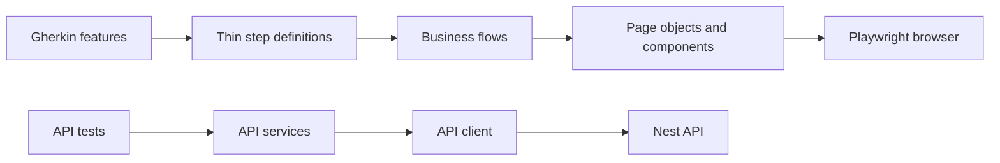

# ProductFlow 360 Automation

This folder contains the scalable QA automation framework for ProductFlow 360. It preserves the application and separates UI browser automation from API automation.

## Architecture



`tests/ui` contains executable Playwright UI tests. `features` is the business-readable BDD layer; install dependencies in this folder to run Cucumber. Page objects own screen actions, components own reusable navigation, and tests retain assertions.

## Layout

| Path | Responsibility |
| --- | --- |
| `config/` | Environment selection and browser configuration. |
| `src/ui/pages`, `src/ui/components` | POM and reusable UI controls. |
| `src/api/clients`, `src/api/services` | APIRequestContext client and service layer. |
| `tests/ui`, `tests/api` | Executable UI and API automation. |
| `features`, `step-definitions` | Gherkin scenarios and thin BDD mappings. |
| `test-data/` | Non-secret JSON data. |
| `reports/`, `artifacts/` | Generated reports and failure evidence; ignored by Git. |

## Install and configure

```bash
cd playwright
npm install
npx playwright install
cp .env.example .env
```

Set secrets with environment variables or CI secrets. Do not commit real passwords, tokens or storage state. `TEST_ENV=dev|qa|staging` selects the matching documented environment contract; CI should inject its own `BASE_URL`, `API_BASE_URL`, `TEST_USER_EMAIL` and `TEST_USER_PASSWORD`.

## Execute

From the repository root:

```bash
npm run test:ui
npm run test:smoke
npm run test:regression
npm run test:api
```

From this folder, use `npm run test:chromium`, `npm run test:firefox`, `npm run test:webkit`, `npm run test:headed` (add `--headed`), or `npm run report`. The default root run targets Chromium only; cross-browser execution is intentional rather than automatic for every local change.

Failure-only screenshots, videos and traces are configured. Open a trace with `npx playwright show-trace <trace.zip>` and reports with `npx playwright show-report reports/playwright`.

## Extending the framework

1. Create a page object action in `src/ui/pages` using `getByRole`, `getByLabel`, then `getByPlaceholder` before CSS selectors.
2. Add a business flow only when it crosses pages.
3. Add a focused test under `tests/ui` or `tests/api`.
4. Add an optional business-readable feature and a thin step definition.
5. Keep data in JSON/factories and make generated records identifiable as automation data.

API tests must use a service built on `BaseApiClient`; endpoint paths must not be scattered through UI pages. The current browser-local prototype does not expose every requested CRUD API in a production shape, so API coverage begins with health and expands when server endpoints are enabled.

## CI

CI installs dependencies and browsers, runs typecheck/API tests/UI smoke, then uploads `playwright/reports` and `playwright/artifacts` on failure. Never upload secrets, local auth state or customer evidence.
