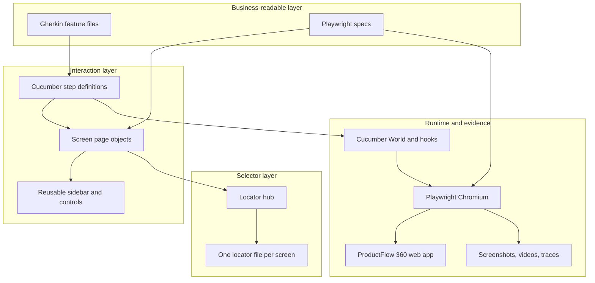
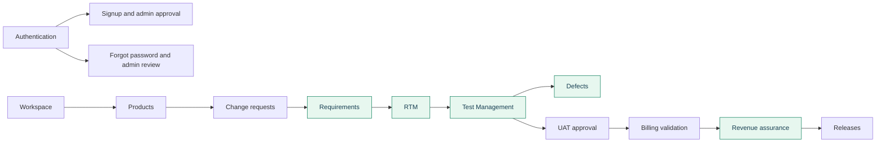
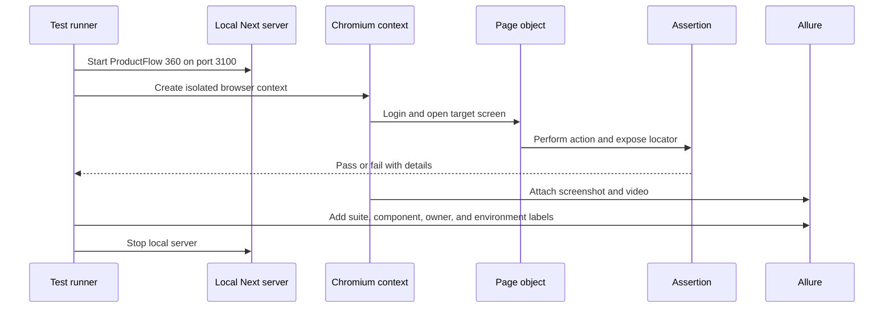
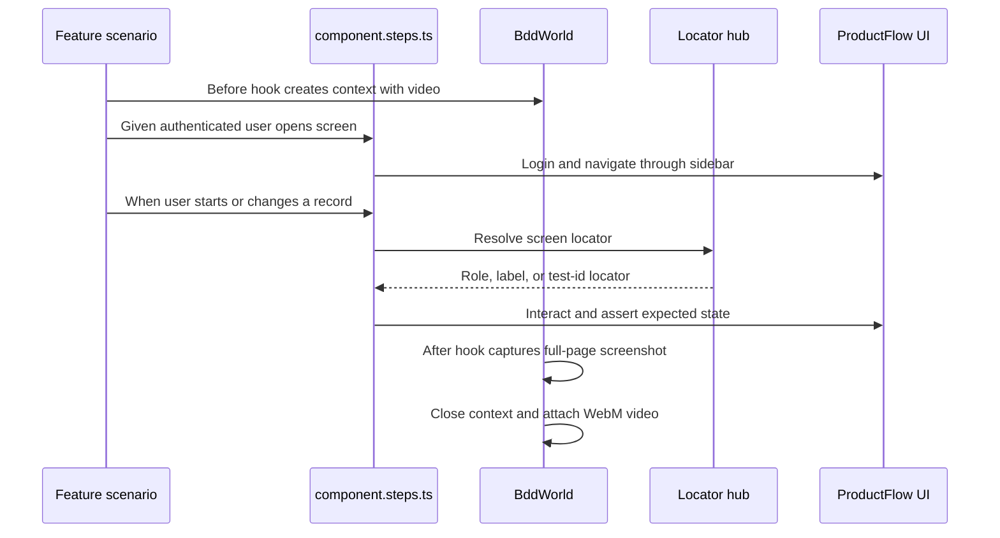
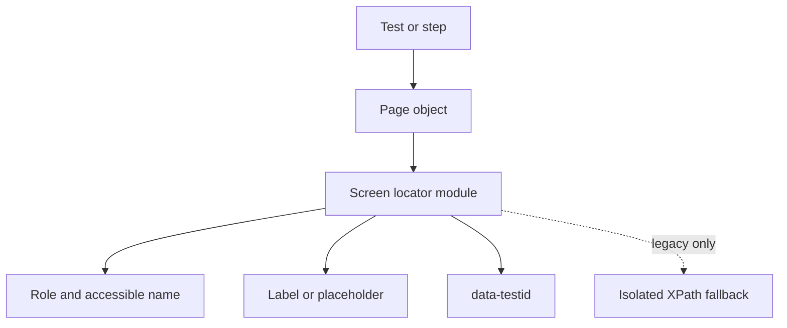
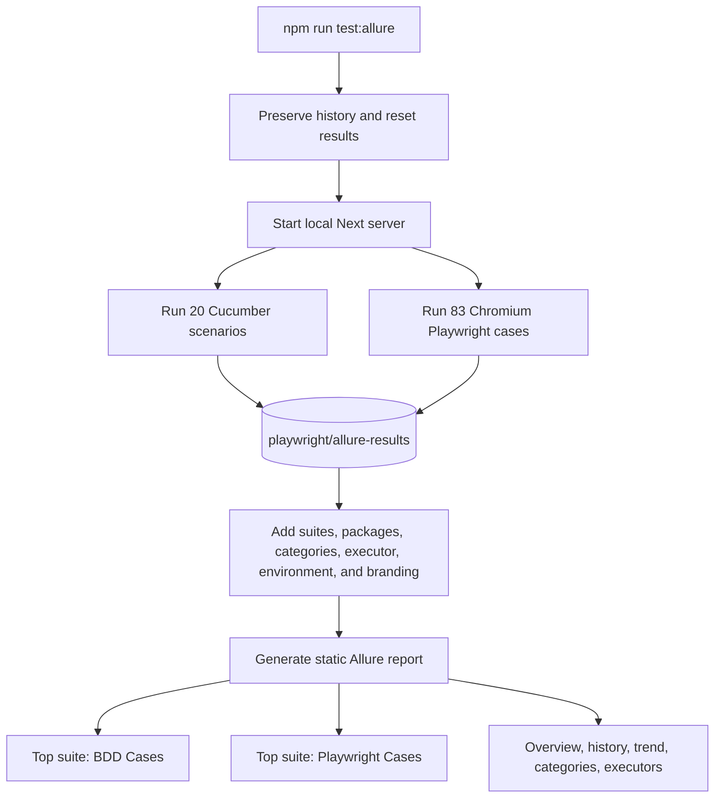
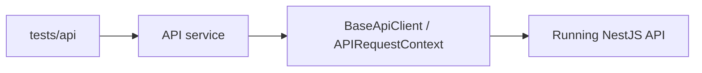

# ProductFlow 360 Automation Architecture

This document describes the executable browser and API automation, its functional coverage, evidence flow, and Allure model. The verified Chromium baseline is **83 Playwright UI cases plus 20 Cucumber scenarios: 103 passed**.

## Layered design

Specs and Gherkin steps express assertions. Page objects expose screen actions. Locator files own selectors. Cucumber World owns scenario browser lifecycle and attachments. This keeps changes to UI wording or roles localized to a screen's locator and page object.

## Functional coverage map

The green modules have four executable BDD scenarios each in addition to Playwright coverage. Playwright suites cover the wider product, including settings, workspace, products, change requests, billing, releases, signup, recovery, smoke, and end-to-end creation.

| Coverage source | Count | Scope |
| --- | ---: | --- |
| Playwright UI | 83 | Component checks, positive and negative paths, access flows, lifecycle boards, smoke, and record creation. |
| Cucumber BDD | 20 | Four scenarios each for RTM, Defects, Test Management, Requirements, and Revenue Assurance. |
| API tests | 2 | Health success and unknown-route negative path; enabled only when the API runs. |

## Browser test lifecycle

Every test starts from an independent login or setup path. Playwright runs with four workers. Cucumber runs sequentially because its TypeScript runtime and hooks share the main process configuration. Assertions use Playwright's auto-waiting matchers; fixed sleeps are avoided.

## BDD execution flow

Feature files live under `playwright/features/<component>`. The active Cucumber configuration includes the five maintained BDD feature folders and all 20 scenarios are executable.

## Locator ownership

Preferred selector order is role and accessible name, label, placeholder, text, test id, then minimal CSS. XPath fallbacks remain isolated in `xpath-fallbacks.ts`. Tests should never scatter raw selectors when a screen locator module can own them.

## Combined Allure pipeline

The report generator identifies Cucumber results through the `cucumberjs` framework label. A `@component_*` tag provides the exact BDD component suite. Playwright results are grouped under **Playwright Cases** and classified by module or flow. Generated reports, raw results, videos, and saved report history are ignored by Git.

## API boundary

API tests use `PF360_RUN_API_TESTS=1` as an explicit availability gate. This prevents a browser-only run from reporting infrastructure failures when the separate API has not been started. API endpoint paths belong in services and clients, not UI page objects.

## Directory responsibilities

| Path | Responsibility |
| --- | --- |
| `config/environment.ts` | Base URLs and credentials supplied through environment variables. |
| `features` | Executable business scenarios. |
| `step-definitions` | Thin Gherkin-to-browser mappings. |
| `support/bdd-world.ts` | Per-scenario browser, screenshot, and video lifecycle. |
| `src/ui/locators` | Central screen selector modules. |
| `src/ui/pages`, `src/ui/components` | Reusable screen actions and navigation. |
| `src/api` | API clients and services. |
| `tests/ui`, `tests/api` | Playwright cases and assertions. |
| `scripts` | Result reset, combined execution, and branded Allure generation. |
| `reports`, `artifacts`, `allure-results` | Generated local output; not source controlled. |

## Extension rules

1. Add or update the screen locator module.
2. Put reusable interactions in a page object or component.
3. Keep assertions in a Playwright spec or Cucumber step.
4. Give each test independent setup and identifiable generated data.
5. Add BDD only for flows that benefit from business-readable behavior.
6. Run the focused spec first, then `npm run test:allure` when report integration changes.
