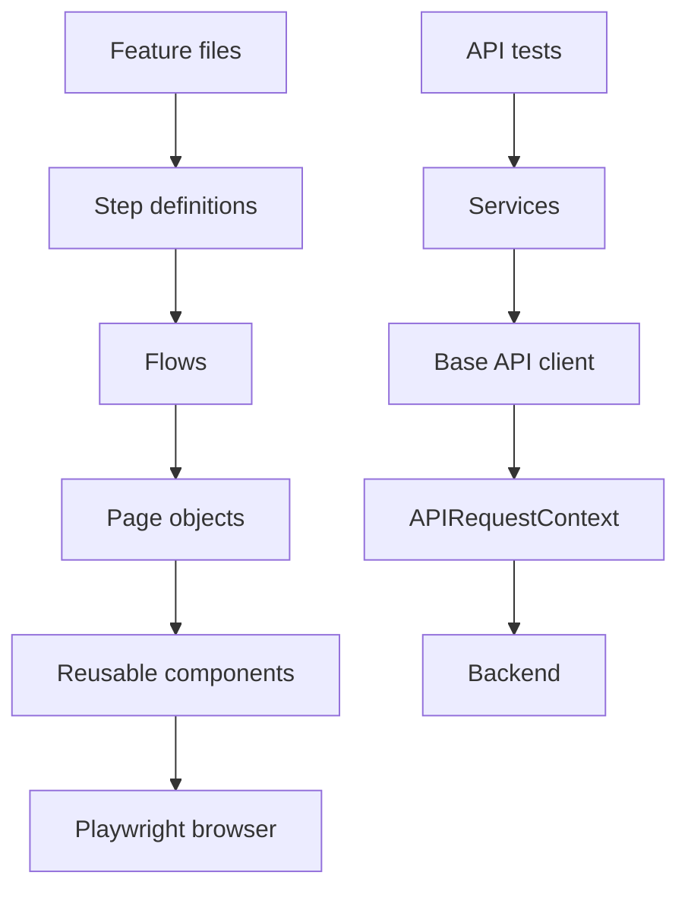

# Automation Architecture

ProductFlow 360 uses an automation boundary that keeps behaviour, browser mechanics and server calls independent.

UI and API layers share typed environment configuration, non-secret test data, utilities and reporting conventions, but UI pages never hide API calls. Preferred locators are role, label, placeholder, text, test id and finally minimal CSS. Tests are independent, avoid sleeps, and retain trace/video/screenshot evidence only on failure.
